# edv_trabajofinal_dcortes
# 📊 Análisis de Ciberseguridad Global (2015–2024)

## 📑 TABLA DE CONTENIDOS
1. [🚀 Presentación del proyecto](#-presentacion-del-proyecto)
2. [📂 Descripción del Dataset](#-descripcion-del-dataset)
3. [🎯 Objetivos e Hipótesis](#-objetivos-e-hipotesis)
4. [📈 Plan de métricas KPI’s](#-plan-de-metricas-kpis)
5. [🔍 EDA: Análisis Exploratorio de Datos](#-eda-analisis-exploratorio-de-datos)
6. [🗂️ DER: Modelo Entidad Relación](#-der-modelo-entidad-relacion)
7. [📊 Conexión y desarrollo en PowerBI](#-conexión-y-desarrollo-en-powerbi)
8. [🧮 Medidas en DAX](#-medidas-en-dax)
9. [Analísis y discusión de resultados](#-analisis-y-discuision-de-resultados)
10. [✅ Conclusiones](#-conclusiones)
    

---

# 1. 🚀 Presentación del proyecto
En un entorno digital cada vez más complejo, los ciberataques se han convertido en una amenaza constante para países, industrias y usuarios.  
Este proyecto utiliza análisis de datos para explorar patrones clave de ciberseguridad, identificar dónde y cómo ocurren los ataques, y comprender su impacto real.  

---

# 2. 📂 Descripción del Dataset
**Global Cybersecurity Threats (2015–2024)**  
Fuente: [Kaggle Dataset](https://www.kaggle.com/datasets/atharvasoundankar/global-cybersecurity-threats-2015-2024)

- Filas: ~3 000 incidentes  
- Columnas: 10 variables principales  
- Formato: CSV  
- Países: Alemania, Australia, Brasil, China, EEUU, Francia, Japón, India, Estados Unidos y Rusia  

👉 *Justificación política y social:* Los ciberataques son una amenaza directa para la estabilidad política, económica y social. Este análisis busca identificar patrones útiles para diseñar políticas de ciberdefensa y cooperación internacional.  

### Diccionario de datos
| Columna (Español)        | Columna (Inglés) | Descripción |
|---------------------------|------------------|-------------|
| País                      | Country          | País donde ocurrió el ataque |
| Año                       | Year             | Año del incidente |
| Tipo_Ataque               | Attack_Type      | Clasificación del ataque |
| Fuente_Ataque             | Attack_Source    | Origen del ataque |
| Vulnerabilidad            | Vulnerability    | Vulnerabilidad explotada |
| Industria                 | Industry         | Sector afectado |
| Mecanismo_Defensa         | Defense_Mechanism| Contramedida aplicada |
| Pérdida_Millones_USD      | Loss_Millions_USD| Pérdida económica |
| Usuarios_Afectados        | Users_Affected   | Personas impactadas |
| Tiempo_Resolución_Horas   | Incident_Resolution_Time_Hours | Tiempo de resolución |

---

# 3. 🎯 Objetivos e Hipótesis

### Objetivo general
Desarrollar un análisis de datos y un dashboard interactivo sobre ciberataques globales utilizando BigQuery y Power BI.

### Objetivos específicos
- Analizar patrones de ciberataques en los 10 países.  
- Diseñar métricas clave de desempeño y riesgo.  
- Crear un dashboard interactivo en Power BI.  

### Hipótesis
- 📌 Primera: La mayoría de los ataques se concentran en pocos países.  
- 💸 Segunda:Los ataques más frecuentes generan mayores pérdidas económicas.  
- 👥 Tercera:Algunas industrias concentran mayor impacto social.  
- 🛡️ Cuarta: Mejores tiempos de respuesta reducen pérdidas económicas promedio.  

---

# 4. 📈 Plan de métricas KPI’s

### Métricas de incidencia

| KPI                              | Descripción                                                       | Cálculo                                                        | Valor Analítico                                     |
|----------------------------------|-------------------------------------------------------------------|----------------------------------------------------------------|-----------------------------------------------------|
| Distribución de ataques por país | Muestra cuántos ataques recibió cada país y qué porcentaje representan del total. | Contar ataques por país y dividir entre el total de ataques. | Permite comparar países y entender la concentración geográfica del riesgo. |
| Total de ataques por año         | Total de incidentes registrados cada año.                         | Sumar todos los ataques reportados en un año.                 | Facilita evaluar tendencias temporales y detectar años críticos. |
| Crecimiento interanual de ataques| Mide la variación porcentual de ataques año contra año.            | (Ataques año actual – año anterior) / año anterior.            | Indica velocidad de incremento o reducción de ciberataques. |
| Distribución de ataques por industria | Ranking de industrias según su nivel de exposición.             | Ataques por industria / total de ataques.                      | Identifica sectores más vulnerables y prioritarios. |

---

### 💸 Métricas económicas

| KPI                                      | Descripción                                        | Cálculo                                   | Valor Analítico                                       |
|------------------------------------------|----------------------------------------------------|-------------------------------------------|-----------------------------------------------------|
| Costo económico por tipo de ataque en cada país | Suma de pérdidas económicas agrupadas por país y por tipo de ataque. | Sumar pérdidas donde coincidan país + tipo de ataque. | Permite identificar amenazas con mayor impacto financiero para cada país. |
| Pérdida promedio por ataque              | Promedio de pérdidas generadas por un incidente.   | Total de pérdidas / número total de ataques. | Evalúa la severidad económica general del ecosistema. |
| Crecimiento interanual de pérdidas       | Variación económica año a año.                     | (Pérdidas año actual – año anterior) / año anterior. | Ayuda a anticipar aumentos futuros y ajustar presupuestos de defensa. |

---

### 👥 Métricas sociales

| KPI                                                              | Descripción                                                         | Cálculo                                         | Valor Analítico                                 |
|------------------------------------------------------------------|---------------------------------------------------------------------|-------------------------------------------------|-----------------------------------------------|
| Total de personas afectadas por país                             | Cantidad total de usuarios impactados en cada país.                 | Sumar usuarios afectados para cada país.        | Mide impacto humano y exposición de datos.     |
| Industria más afectada (impacto × recurrencia)                   | Industria con más ataques considerando personas afectadas y frecuencia. | Multiplicar número de personas afectadas × frecuencia de ataques. | Refleja el nivel de impacto de los ataques en la industria. |

---

### 🛡️ Métricas de defensa

| KPI                                          | Descripción                                              | Cálculo                                                 | Valor Analítico                                        |
|----------------------------------------------|----------------------------------------------------------|---------------------------------------------------------|------------------------------------------------------|
| Defensa más efectiva por tipo de ataque       | Identifica el mecanismo de defensa que mejor reduce el impacto. | Comparar pérdidas o usuarios afectados entre mecanismos para el mismo tipo de ataque. | Optimiza estrategias de ciberseguridad basadas en evidencia. |
| Tiempo promedio de respuesta según tipo de ataque | Evalúa la eficiencia de resolución por tipo de amenaza.   | Promediar horas de resolución agrupadas por tipo de ataque. | Permite identificar ataques que tardan más en resolverse. |
| Tiempo promedio de resolución por industria   | Tiempo medio que tardan en resolverse ataques según industria. | Promediar horas de resolución por industria.             | Identifica sectores con procesos defensivos más lentos o ineficientes. |

---

# 5. 🔍 EDA: Análisis Exploratorio de Datos

### a. SOFTWARE, AI Y LENGUAJES UTILIZADOS


### b. ARQUITECTURA DE DATOS
  

## 🥉 C. CAPA BRONZE

Se creó un proyecto en **BigQuery** con el nombre de `bronzedianacortes`, y en él se crearon dos conjuntos de datos:  
- Uno para la **capa Bronze**  
- Otro para las **tablas de la capa Silver**  

No se crearon dos proyectos diferentes ya que de esta forma fue más práctico y no se registraron impedimentos por orígenes y vinculaciones, como sí ocurrió al intentar hacerlo en proyectos distintos. Esto fue comentado con uno de los instructores en una de las clases, quien refirió que no habría problema alguno.  

La carga de datos se realizó a partir de un archivo **CSV**.  
Previo a su ingesta en BigQuery, se ajustaron los nombres de dos columnas directamente en Excel, ya que contenían caracteres especiales no reconocidos por el motor de BigQuery, lo cual impedía la correcta carga del archivo.  


👉 **Resultado:** El archivo cargó en su totalidad.  


---

## 🥈 D. CAPA SILVER

**Limpieza de datos:**  
A lo largo del proyecto se realizó un proceso de limpieza y preparación del *Global Cybersecurity Threats Dataset (2015–2024)* para asegurar su consistencia y usabilidad en BigQuery y Power BI.  

### 🔧 Principales etapas
- **Revisión y estandarización de columnas**  
  - Se aplicaron funciones de estandarización (`LOWER`, `TRIM`, `REGEXP_REPLACE`) en BigQuery para identificar categorías con variaciones de escritura.
  - El análisis mostró que los tipos de ataque ya se encontraban homogéneos.
  -  
  - Se verificaron los nombres de las columnas y se renombraron para mantener un formato estándar.
 

- **Tratamiento de valores faltantes**  
  - No se identificaron campos con valores nulos.
   -  
     
  - Los nombres de países ya estaban estandarizados.  
  - Se verificó que el modelo de datos se conectara correctamente con BigQuery.  
  - Se revisaron las relaciones entre tablas y se ajustaron cardinalidades.  
  - Se creó la tabla **Silver** con datos limpios y nombres estándar.
  - -   
  - No fue necesario realizar conversiones de fechas, ya que el dataset solo incluía la variable **AÑO**.
    
```sql
CREATE OR REPLACE TABLE `bronzedianacortes.Cyberthreats_Silver.Amenazas_Globales_Silver` AS
SELECT
    Pais,
    Anio,
    Tipo_Ataque,
    Fuente_Ataque,
    Vulnerabilidad,
    Industria,
    Mecanismo_Defensa,
    CAST(Perdida_Millones_USD AS FLOAT64) AS Perdida_Millones_USD,
    CAST(Usuarios_Afectados AS INT64) AS Usuarios_Afectados,
    CAST(Tiempo_Resolucion_Horas AS FLOAT64) AS Tiempo_Resolucion_Horas
FROM `bronzedianacortes.Cyberthreats_Bronze.Amenazas_Globales`;
```


### 📊 Tabla Silver Original
La tabla `Amenazas_Globales_Silver` se creó para asegurar datos limpios, consistentes y listos para análisis, actuando como la base sólida necesaria para construir un modelo confiable y un Dashboard analítico de ciberseguridad.  
Los nombres de las columnas se tradujeron a Español.  

👉 **Nota:** Todas las columnas fueron útiles para el análisis, por lo que se consideraron en su totalidad.  


---

## 🗂️ Tablas Dimensionales

Se crearon **cinco tablas dimensionales en BigQuery** y con ellas la **tabla FACT**, todas con lenguaje SQL.  
A cada tabla se le asignó una columna adicional de **ID** que funcionó como *Primary Key* en la tabla FACT, esto por sugerencia del instructor y como forma de generar un análisis más limpio y preciso.  

- **DIM_DATE**
- 
- 

```sql
- CREATE OR REPLACE TABLE `bronzedianacortes.Cyberthreats_Silver.Dim_Date` AS
SELECT DISTINCT
    Year_ID
FROM `bronzedianacortes.Cyberthreats_Silver.Amenazas_Globales_Silver`
WHERE Anio IS NOT NULL;
```

- **DIM_PAIS**
- Con ella se buscó normalizar la información de países y asociar cada registro con un ID único.
  Se crearon atributos adicionales como Continente e ISO, para facilitar joins consistentes con la FACT.
- 

```sql
CREATE OR REPLACE TABLE `bronzedianacortes.Cyberthreats_Silver.DIM_Pais` AS
SELECT
    ROW_NUMBER() OVER (ORDER BY Pais) AS Pais_ID,
    Pais,
    Continente,
    ISO
FROM (
    SELECT DISTINCT
        Pais,
        Continente,
        ISO
    FROM `bronzedianacortes.Cyberthreats_Silver.Amenazas_Globales_Silver`
    WHERE Pais IS NOT NULL
      AND Continente IS NOT NULL
      AND ISO IS NOT NULL
);

```

- **DIM_ATTACK**  
  - Para ataques, se tomaron tres categorías originales (*Tipo de ataque, Fuente del ataque, Tipo de vulnerabilidad*) y se fusionaron, asignando un código único a cada combinación distinta.
  - Consolida información relacionada con el ataque en una sola tabla: Tipo, Fuente y Vulnerabilidad.
  - Cada ID representa la combinación única de los tres                                                                                        
El ID de ataque permitió vincular de mejor maanera cada incidente de la FACT con su descripción detallada sin repetir datos.
  - Esto también simplificó las dimensiones.
  - se llevó a cabo como experimento con el fin de agregar análisis mas profundo a los al modelo. Las tres características juntas describen completamente la naturaleza de cada incidente.
  - Al consolidarlas en un solo ID, se evita la duplicación de información en la FACT y se facilita el análisis multidimensional de los ataques, permitiendo identificar patrones, tendencias y relaciones entre distintos tipos de amenazas de manera consistente y eficiente.
  - 

 ```sql
CREATE OR REPLACE TABLE `bronzedianacortes.Cyberthreats_Silver.DIM_Ataque` AS
SELECT
    ROW_NUMBER() OVER (
        ORDER BY Tipo_Ataque, Fuente_Ataque, Vulnerabilidad
    ) AS Ataque_ID,
    Tipo_Ataque,
    Fuente_Ataque,
    Vulnerabilidad
FROM (
    SELECT DISTINCT
        Tipo_Ataque,
        Fuente_Ataque,
        Vulnerabilidad
    FROM `bronzedianacortes.Cyberthreats_Silver.Amenazas_Globales_Silver`
    WHERE Tipo_Ataque IS NOT NULL
      AND Fuente_Ataque IS NOT NULL
      AND Vulnerabilidad IS NOT NULL
);

```
  
- **DIM_DEFENSA**

  Enumera los mecanismos de defensa posibles y asigna un ID a cada uno.
Su sentido es permitir que la FACT pueda referenciar los mecanismos de defensa sin repetir nombres largos, manteniendo consistencia.
- 

```sql
CREATE OR REPLACE TABLE `bronzedianacortes.Cyberthreats_Silver.DIM_Defensa` AS
SELECT
    ROW_NUMBER() OVER (ORDER BY Mecanismo_Defensa) AS Defensa_ID,
    Mecanismo_Defensa
FROM (
    SELECT DISTINCT
        Mecanismo_Defensa
    FROM `bronzedianacortes.Cyberthreats_Silver.Amenazas_Globales_Silver`
    WHERE Mecanismo_Defensa IS NOT NULL
);
```
- **DIM_INDUSTRIA**

- Centraliza todas las industrias afectadas y asigna un ID único a cada una.
Esto ayuda a la FACT a referenciar la industria de manera consistente.
-  

```sql
CREATE OR REPLACE TABLE `bronzedianacortes.Cyberthreats_Silver.DIM_Industria` AS
SELECT
    ROW_NUMBER() OVER (ORDER BY Industria) AS Industria_ID,
    Industria
FROM (
    SELECT DISTINCT
        Industria
    FROM `bronzedianacortes.Cyberthreats_Silver.Amenazas_Globales_Silver`
    WHERE Industria IS NOT NULL
);
```
---

## ⭐ Tabla FACT (Hechos)

- La tabla `FACT_Cyberthreats` centraliza los datos y los relaciona con las diferentes tablas dimensionales por medio de las claves asignadas.  
- La construcción de esta tabla fue esencial para estructurar el **modelo estrella** de análisis de datos, ya que permitió crear un esquema sólido, relacional y para explorar tendencias, patrones de ataque y efectos económicos y sociales dentro del panorama de amenazas cibernéticas.  
- Se agregaron columnas con título **“raw”** para identificar cada uno de los nombres y categorías a las que se les había asignado un ID.  

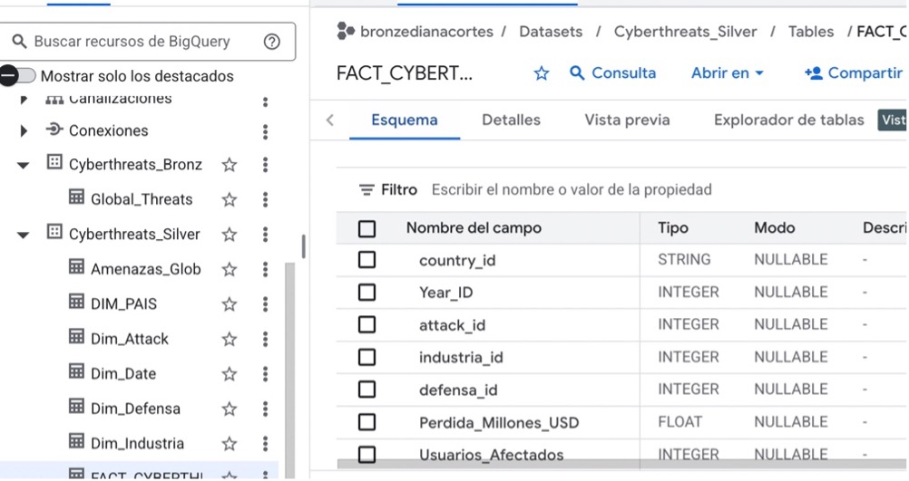

```sql
CREATE OR REPLACE TABLE `bronzedianacortes.Cyberthreats_Silver.FACT_CYBERTHREATS` AS
SELECT
    -- Claves de dimensiones
    p.Pais_ID            AS country_id,
    s.Anio               AS Year_ID,
    a.Ataque_ID          AS attack_id,
    i.Industria_ID       AS industria_id,
    d.Defensa_ID         AS defensa_id,

    -- Métricas
    s.Perdida_Millones_USD,
    s.Usuarios_Afectados,
    s.Tiempo_Resolucion_Horas,

    -- Campos raw (tal cual se conservaron)
    s.Pais               AS country_name_raw,
    s.Anio               AS year_raw,
    s.Tipo_Ataque        AS attack_type_raw,
    s.Fuente_Ataque      AS source_raw,
    s.Vulnerabilidad     AS vulnerability_raw,
    s.Industria          AS industry_raw,
    s.Mecanismo_Defensa  AS defense_raw

FROM `bronzedianacortes.Cyberthreats_Silver.Amenazas_Globales_Silver` s

LEFT JOIN `bronzedianacortes.Cyberthreats_Silver.DIM_Pais` p
  ON s.Pais = p.Pais
 AND s.Continente = p.Continente
 AND s.ISO = p.ISO

LEFT JOIN `bronzedianacortes.Cyberthreats_Silver.DIM_Ataque` a
  ON s.Tipo_Ataque = a.Tipo_Ataque
 AND s.Fuente_Ataque = a.Fuente_Ataque
 AND s.Vulnerabilidad = a.Vulnerabilidad

LEFT JOIN `bronzedianacortes.Cyberthreats_Silver.DIM_Industria` i
  ON s.Industria = i.Industria

LEFT JOIN `bronzedianacortes.Cyberthreats_Silver.DIM_Defensa` d
  ON s.Mecanismo_Defensa = d.Mecanismo_Defensa;
```

# 6. 🗂️ Modelo Entidad Relación

- 

 # 7. 🗂️ Conexión y desarrollo en PowerBI

### 📥 Tablas importadas

Power BI se conectó directamente al proyecto de BigQuery e importó las siguientes tablas:

- 📊 **Tabla FACT**
  - `FACT_CYBERTHREATS`
- 📐 **Tablas de dimensiones**
  - `DIM_PAIS`
  - `DIM_DATE`
  - `DIM_ATTACK`
  - `DIM_INDUSTRIA`
  - `DIM_DEFENSA`
 
  - - - 
- En la tabla de ataques se creó una columa adicional que asigna un nombre combinado a cada ID.
- Esto con el fin de que cada código también sea reconocido desde el atque, fuente y vulnerabilidad que representa, sin crear confusión y para facilitar su graficación
- 

- la tabla de fecha, que en este caso represneta la DIM_DATE generó algunos problemas de formato por lo qe se le asignó valor de numro entero, esto, sin mebargo, no interfiri´mayormente en este modelo de análisis
- - 
---

### 🔗 Modelo entidad–relación

- La tabla `FACT_CYBERTHREATS` actúa como tabla central.
- Todas las dimensiones se conectan mediante claves sustitutas (`*_id`).
- Las relaciones son de tipo **uno a muchos (1:N)** desde las dimensiones hacia la tabla fact.
-  
- Se creó además una tabla adicional con las medidas, esta no va conectada al modelo
- - - 
---

## 8. 🧮 Medidas DAX

Los cálculos se implementaron mediante **medidas DAX**, 

### 📈 Principales Métricas de Incidencia

**Total de ataques**
```DAX
Total Ataques = COUNTROWS(FACT_CYBERTHREATS)
```
**Ataques por año**
```DAX
Ataques por Año = COUNTROWS(FACT_CYBERTHREATS)
```
**YoY Crecimiento Ataques** 
```DAX
Crecimiento Ataques YoY =
DIVIDE(
    [Total Ataques] -
    CALCULATE([Total Ataques], SAMEPERIODLASTYEAR(DIM_DATE[Year_ID])),
    CALCULATE([Total Ataques], SAMEPERIODLASTYEAR(DIM_DATE[Year_ID]))
)
```

**Distribución: porcentaje de ataques por país** 
```DAX
% Ataques por País =
DIVIDE(
    [Total Ataques],
    CALCULATE([Total Ataques], ALL(DIM_PAIS))
)
```
### 👥 Métricas Sociales

**Total de usuarios afectados**
```DAX
Impacto Humano por Ataque =
SUM(FACT_CYBERTHREATS[Usuarios_Afectados])
```

ℹ️ El dataset no permite identificar usuarios únicos; las métricas representan el total de usuarios reportados como afectados.

### 🛡️ Métricas de Defensa

**Tiempo promedio de resolución**
``DAX
Tiempo Promedio Resolución =
AVERAGE(FACT_CYBERTHREATS[Tiempo_Resolucion_Horas])
```

**Tiempo de resolución por tipo de ataque**
```DAX
Tiempo Resolución por Ataque =
AVERAGE(FACT_CYBERTHREATS[Tiempo_Resolucion_Horas])
```

**Tiempo de resolución por industria**
```DAX
Tiempo Resolución por Industria =
AVERAGE(FACT_CYBERTHREATS[Tiempo_Resolucion_Horas])
```

### 📊 Diseño del Dashboard

El dashboard se organizó en páginas temáticas:

👥 Portada

 
  - 👥 overview
 
  - 
 - MAPA GEOGRAFICO : Gráfico de Muestra la proporción de ataques cibernéticos registrados en cada país respecto al total, permitiendo comparar su peso relativo dentro del conjunto analizado.
 -  

- TARJETAS KPI : se incluyen para mostrar de forma inmediata y clara los indicadores y m´tericas claves y más importantes, permitiendo tener un vistazo general.
- 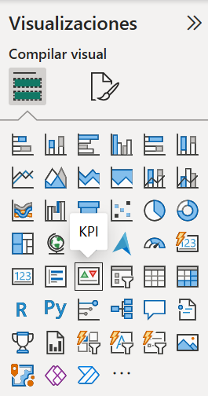  - 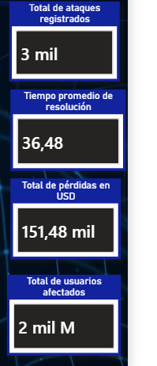

- GRAFICOS COMBIANDOS LÍNEAS Y BARRAS: para representar la frecuencia de los ataques y las pérdidas económicas en USD. Este enfoque permitió analizar de forma conjunta el volumen de ataques y su impacto económico según las dimensiones consideradas.
- 
- - - 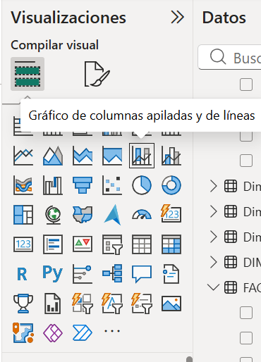- 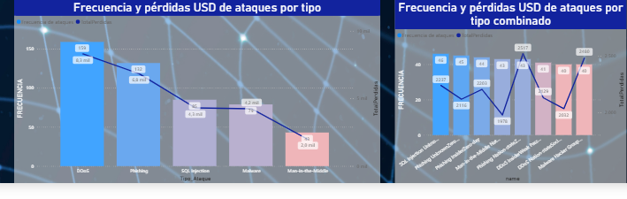


    📈 Incidencia

- - 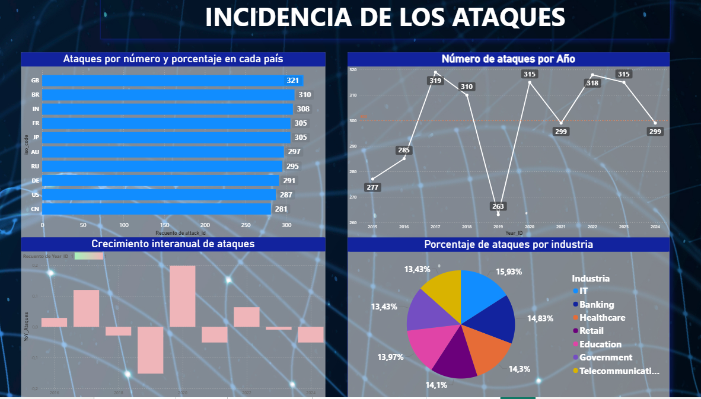
 
-Distribución geográfica
Los ataques presentan una alta concentración en economías digitalmente maduras, lideradas por Reino Unido, Brasil e India. La diferencia entre países es relativamente estrecha, lo que sugiere un riesgo cibernético globalizado más que fenómenos aislados por región.

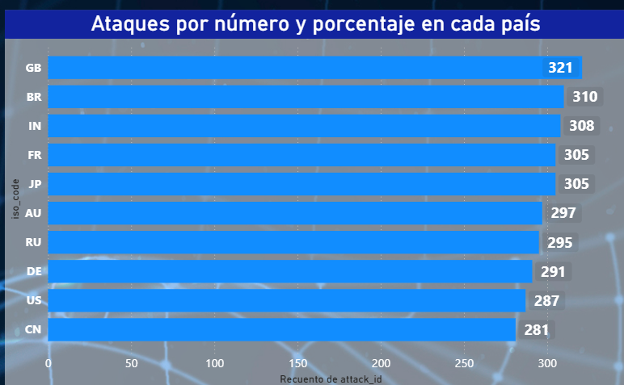

-Evolución temporal
El número de ataques muestra una tendencia volátil pero estructuralmente alta a lo largo del tiempo. Se observan picos significativos en 2017, 2020 y 2023, intercalados con caídas pronunciadas (especialmente en 2019), lo que indica eventos disruptivos puntuales más que un crecimiento lineal sostenido.

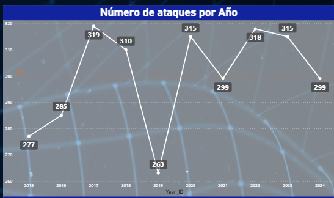

-Crecimiento interanual
El crecimiento interanual alterna entre expansiones y contracciones, evidenciando alta variabilidad.

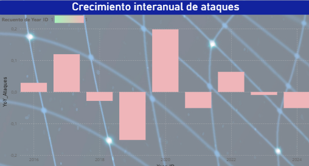

-Distribución por industria
La incidencia por sector es notablemente homogénea, con porcentajes cercanos al 14–16 % en todas las industrias analizadas. IT lidera pero la baja dispersión indica que ningún sector está significativamente más expuesto, reforzando la naturaleza transversal del riesgo cibernético.

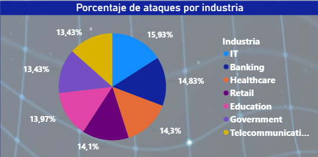
 
💰 Impacto económico y social

- - 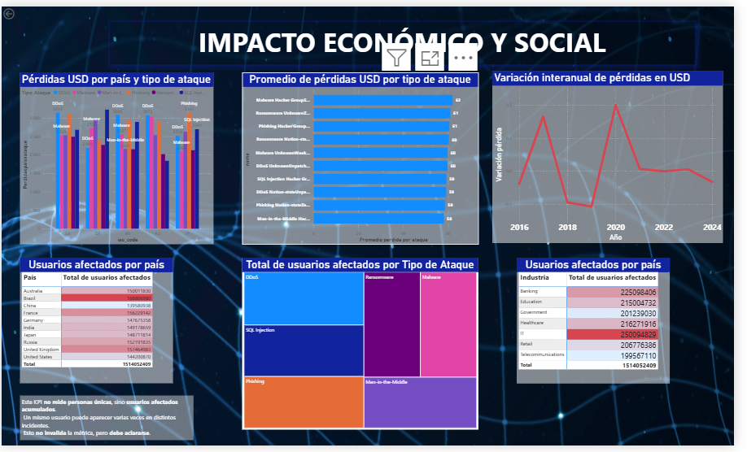


  - Pérdidas económicas por país y tipo de ataque
Las pérdidas en USD muestran alta dispersión entre países y vectores de ataque, con DDoS, Ransomware y SQL Injection concentrando los mayores impactos financieros. Esto sugiere que los ataques a infraestructura crítica y disponibilidad generan costos significativamente más elevados que los ataques puramente informativos.
- - 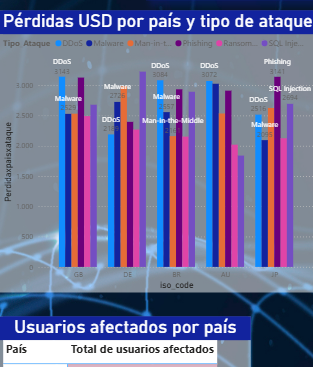

- - 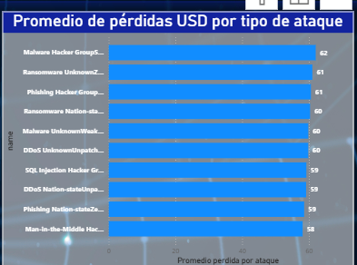
-Promedio de pérdidas por tipo de ataque
El promedio de pérdidas es relativamente homogéneo, con valores cercanos entre sí (≈58–62 USD por evento). Esta baja variabilidad indica que, independientemente del vector, los ataques tienden a generar costos recurrentes y previsibles, más asociados a mitigación y recuperación que a eventos extremos aislados.

- - 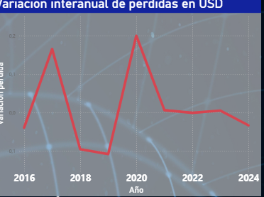
-Variación interanual de pérdidas
La variación interanual presenta picos pronunciados, especialmente en 2017 y 2020, lo que evidencia shocks económicos asociados a contextos específicos. Posteriormente, la volatilidad disminuye, sugiriendo una posible mejor adaptación organizacional frente a incidentes cibernéticos.

-Usuarios afectados por país
El número de usuarios afectados es elevado y consistente entre países, reforzando el carácter masivo y acumulativo del impacto social. Las diferencias observadas reflejan tanto el tamaño poblacional como el grado de digitalización.

-Usuarios afectados por tipo de ataque
Los ataques DDoS y Ransomware concentran la mayor cantidad de usuarios afectados, confirmando que los ataques orientados a interrupción de servicios tienen un impacto social superior frente a ataques más focalizados.

-Usuarios afectados por industria
IT, Retail y Banking lideran en número de usuarios afectados, lo que evidencia una exposición sistémica de sectores intensivos en datos y transacciones. La distribución confirma que el riesgo cibernético es transversal, pero con mayor externalidad social en sectores de alta interacción con usuarios finales.

🛡️ Defensa
- - 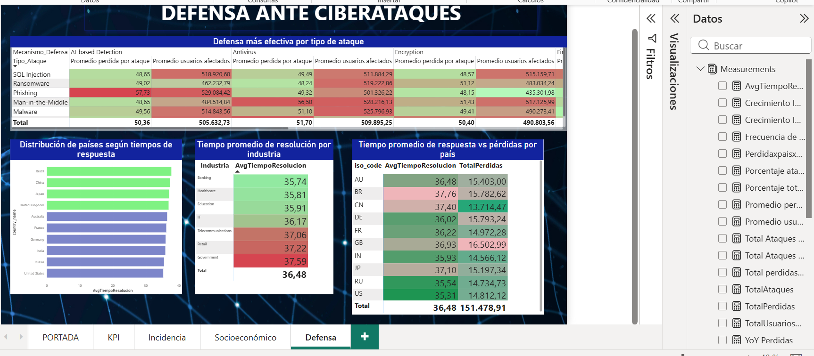
  - 
  - El heatmap en la matriz se incorporó para facilitar la identificación visual de patrones, concentraciones y contrastes entre categorías, permitiendo detectar rápidamente dónde se acumulan mayores valores de impacto o frecuencia sin necesidad de analizar cada cifra de forma individual.
  - - - 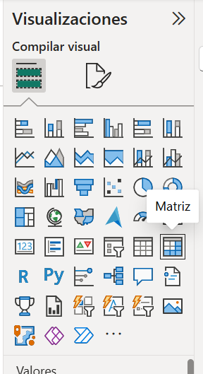 - 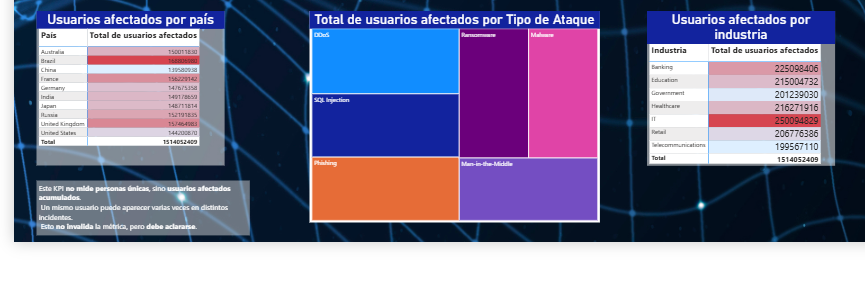
  - 
Se utilizaron gráficos de barras, gráfios de líneas,treemap, gráficos circulares y tarjetas KPI.

### Dashboard desde el enfoque gráfico y de diseño
- se eligió un fondo oscuro alusivo a ciberseguridad, originario de Freepik

- ### 📊 Análisis y discusión de resultados

## Comprobación de las hipótesis
 
-📌 Primera:Aunque el dataset es limitado y no permite afirmar diferencias abismales entre países, sí muestra que existen algunos países donde los ataques se concentran de manera notable. Los datos reflejan que, dentro del alcance del estudio, el fenómeno se distribuye de forma muy uniforme, pero es posible identificar los países más afectados (EEUU, Brasil e India) como focos principales del ciberataque. Esto, sin embargo, hay que analizarlo con cuidado, pues puede indicar que los datos podrían estar sesgados o incompletos, y que los patrones reales podrían diferir significativamente si se contaran incidentes no reportados o en regiones fuera del dataset.

-💸 Segunda:La relación entre la frecuencia de los ataques y las pérdidas económicas solo se mantiene de forma consistente cuando se analiza el Tipo de Ataque de manera individual. En este nivel, los ataques más comunes concentran mayores pérdidas acumuladas. Sin embargo, al incorporar variables adicionales como la vulnerabilidad y la fuente del ataque, esta relación se diluye: algunos ataques frecuentes presentan pérdidas bajas, mientras que ataques menos comunes generan impactos económicos elevados. Esto evidencia que la relación entre frecuencia e impacto económico depende significativamente del nivel de granularidad del análisis.

-👥Tercera: La tercera hipótesis se ve respaldada parcialmente, ya que el análisis del mapa de calor evidencia una mayor concentración del impacto social en los sectores de banking e IT. No obstante, las diferencias observadas respecto a los demás sectores no presentan una magnitud suficientemente elevada como para afirmar una brecha estadísticamente significativa, lo que sugiere una distribución relativamente homogénea del impacto social entre los distintos sectores analizados.

-🛡️Cuarta:El análisis de datos confirma que, dentro del conjunto analizado, existe una relación consistente entre los tiempos de resolución de los ataques y las pérdidas económicas promedio asociadas. Se observa que aquellos ataques que presentan menores tiempos promedio de resolución tienden a estar asociados con un menor impacto económico, mientras que los ataques con tiempos de respuesta más prolongados muestran, en promedio, pérdidas económicas más elevadas. En el caso de EEUU, con el menor tiempo de resolucion de 35,3H, las pérdidas oscilan ntre los 14.812 MILL USD mientras que Brasil, co el mayor tiempo 37,7H, presenta pérdidas de 15.782 Mill USD.


- ### 10. 📊 Conclusiones
  
- El análisis del dataset Global Cybersecurity Threats (2015–2024) muestra que el impacto de los ciberataques tiende a distribuirse de manera relativamente homogénea, sin evidenciar diferencias abismales entre países, industrias o tipos de ataque dentro del alcance de los datos disponibles. No obstante, es posible identificar ciertos focos de concentración —como GB, EEUU, Brasil e india  así como los sectores de banca e IT— que destacan de forma recurrente en términos de frecuencia, impacto económico y afectación social. Esto sugiere que las diferencias observadas deben interpretarse con cautela, pues la aparente uniformidad del fenómeno podría estar influida por limitaciones estructurales o sesgos del dataset. En consecuencia, los patrones identificados reflejan tendencias dentro del universo analizado, pero no necesariamente la magnitud real del fenómeno a escala global.

- Los resultados evidencian que la relación entre la frecuencia de los ataques y su impacto económico o social no es lineal ni automática, sino que depende del nivel de agregación y de las variables consideradas. Mientras que, a nivel agregado, los tipos de ataque más frecuentes tienden a concentrar mayores pérdidas acumuladas, este patrón se diluye al incorporar dimensiones adicionales como la vulnerabilidad explotada o la fuente del ataque, revelando escenarios donde ataques menos comunes pueden generar impactos desproporcionadamente altos.

- De manera consistente, el análisis operativo confirma la importancia crítica de la capacidad de respuesta: los ataques con menores tiempos promedio de resolución están asociados con menores pérdidas económicas, mientras que respuestas más lentas tienden a amplificar el daño financiero. Esto refuerza la idea de que, más allá de la prevención, la eficiencia en los mecanismos de defensa y mitigación juega un rol determinante en la reducción del impacto de los ciberataques, convirtiéndose en un factor estratégico clave para la gestión del riesgo cibernético.

